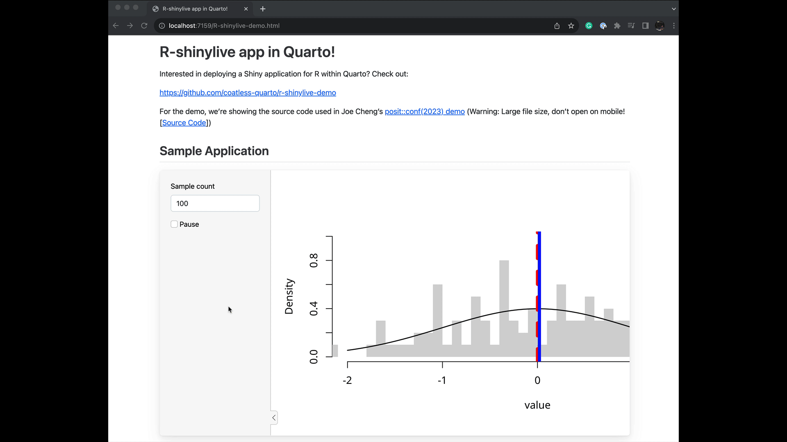

# r-shinylive-demo

Interested in deploying a Shiny application for R within Quarto? This repository is for you!

We're showing the source code used in Joe Cheng's [posit::conf(2023) demo](https://github.com/jcheng5/posit-conf-2023-shinylive/blob/d385ad18eb0d867f25cc4721d9e8c25aeb2dfb90/slides.qmd#L299)

## Sample App



# Tutorial: Using r-shinylive for Static Shiny Apps in Quarto Documents

Are you interested in creating your own Quarto document with embedded static Shiny apps? This tutorial will guide you through the process of using the `r-shinylive` R package to achieve just that. Let's get started!

## Installation

**Step 1:** Install the `r-shinylive` R package. It's currently hosted on GitHub and can be obtained from the R console using the following command:

```r
# Install the 'pak' package manager if you haven't already
install.packages("pak")
# Install 'r-shinylive' using 'pak'
pak::pak("posit-dev/r-shinylive")
```

## Setting Up Your Quarto Project

**Step 2:** Create a new Quarto project. Open your terminal and execute the following command:

```sh
quarto create project default
```


During project creation, you'll be prompted to provide a directory name. This name will also serve as the Quarto document filename. Please note that if you skip this step, a `_quarto.yml` file won't be generated, resulting in an error when you attempt to render the document.

```md
ERROR: The shinylive extension must be used in a Quarto project directory (with a _quarto.yml file).
```

## Installing the Quarto Extension for r-shinylive

**Step 3:** Install the Quarto extension for `shinylive`. In the Terminal tab, run the following command:

```sh
quarto add quarto-ext/shinylive
```


## Including the Shiny App in Your Quarto Document

**Step 4:** To include a Shiny app directly in your Quarto file (`.qmd`), you need to add a filter key for `shinylive` at the top of the desired Quarto file. Open your Quarto file and add the following YAML header:

```yml
filters:
  - shinylive
```

**Step 5:** Place your Shiny application code within your Quarto file (`.qmd`) as follows:

```r
---
title: "Our first r-shinylive Quarto document!"
filters:
  - shinylive
---

```{shinylive-r}
#| standalone: true

ui <- ...

server <- function(input, output, session) {
  ...
}

shinyApp(ui, server)
```

## Rendering Your Quarto Document

**Step 6:** Once you are satisfied with your Shiny app and content, render the document by pressing the Render button in RStudio.


Or type in the Terminal tab:

```sh
quarto preview R-shinylive-demo.qmd --no-browser --no-watch-inputs
```

## Folder Structure

During the render process, the output directory should contain the following structure:

```sh
.
├── _extensions
│   └── quarto-ext/shinylive # Added by 'quarto add'
├── _quarto.yml              # Created by 'quarto create'
├── R-shinylive-demo.html
├── R-shinylive-demo.qmd
├── R-shinylive-demo_files
│   └── libs
└── shinylive-sw.js
```

## References

- [Shinylive R Package](https://github.com/posit-dev/r-shinylive)
- [Shinylive Quarto Extension](https://github.com/quarto-ext/shinylive): Static Shiny apps as Quarto code chunks

Now you have successfully integrated static Shiny apps into your Quarto documents using the `r-shinylive` package. Happy Quarto + r-shinyliving!